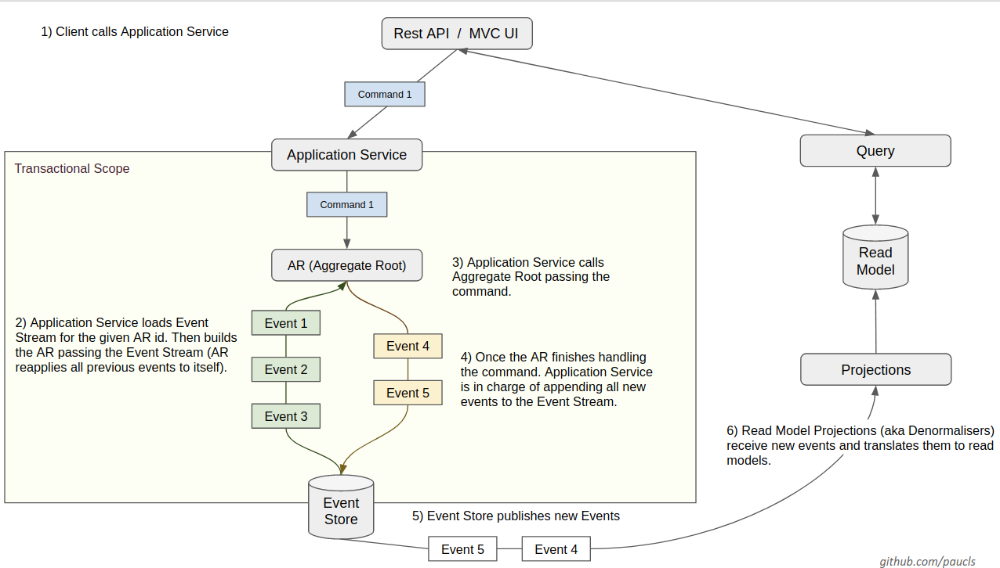

# runbook-ddd-cqrs-microservice

A sample microservice with CQRS and Event Sourcing architecture. Implemented in Java and Spring Boot.

## The Domain
For this sample application, we'll work in a operations team domain. Our focus will be on the concept of a **Runbook** wich tracks tasks. 

## Architecture
CQRS and Event Sourcing architecture

## Overview  
Start your server as an simple java application  

You can view the api documentation in swagger-ui by pointing to  
http://localhost:8080/  

## Demo

## Documentation
Links to some of the articles and documentation used to implement this project:

- Edument CQRS Tutorial http://cqrs.nu/Tutorial
- Implementing Domain-Driven Design, Vaughn Vernon.
- IDDD Samples https://github.com/VaughnVernon/IDDD_Samples
- Why do commands include the entity tabId when creating entities? https://github.com/gregoryyoung/m-r/issues/17
- Should Aggregates be Event Handlers https://stackoverflow.com/questions/26876757/should-aggregates-be-event-handlers
- Should getters from domain classes not be prefixed with “get” in DDD, and why? https://stackoverflow.com/questions/46139501/should-getters-from-domain-classes-not-be-prefixed-with-get-in-ddd-and-why/46141986#46141986
- CQRS + Event Sourcing – A Step by Step Overview, Daniel Whittaker http://danielwhittaker.me/2014/10/02/cqrs-step-step-guide-flow-typical-application/
- Aggregate Root – How to Build One for CQRS and Event Sourcing, Daniel Whittaker http://danielwhittaker.me/2014/11/15/aggregate-root-cqrs-event-sourcing/
- How To Validate Commands in a CQRS Application, Daniel Whittaker http://danielwhittaker.me/2016/04/20/how-to-validate-commands-in-a-cqrs-application/
- CQRS Commands and Queries - Do they belong in the domain? https://stackoverflow.com/questions/32216408/cqrs-commands-and-queries-do-they-belong-in-the-domain
- Implementing an Event Sourced Aggregate, Nick Chamberlain https://buildplease.com/pages/fpc-9/